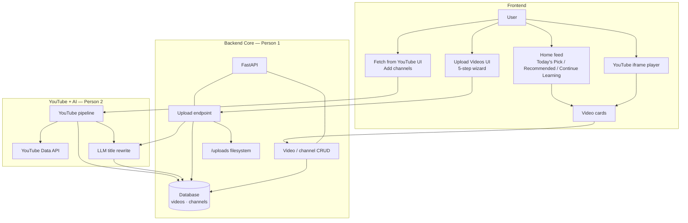
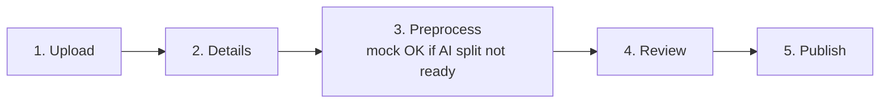

# CrackEd

Monorepo with a React + TypeScript client and a FastAPI server.

## Structure

```
client/   # Vite + React + TypeScript (port 5173)
server/   # FastAPI + Uvicorn (port 8000)
```

## Prerequisites

- Node.js 20+
- Python 3.11+
- Optional: [uv](https://docs.astral.sh/uv/)

## Run the server

With `uv`:

```bash
cd server
uv sync
uv run uvicorn app.main:app --reload --port 8000
```

Or with pip:

```bash
cd server
python3 -m venv .venv
source .venv/bin/activate
pip install -r requirements.txt
uvicorn app.main:app --reload --port 8000
```

API docs: http://127.0.0.1:8000/docs

## Run the client

```bash
cd client
npm install
npm run dev
```

App: http://localhost:5173

Vite proxies `/api/*` to the FastAPI server, so you can call `/api/health` from the browser without CORS issues in local dev.

## Run with Docker

Make sure you have [Docker](https://www.docker.com/) and Docker Compose installed.

```bash
docker compose up --build
```

This starts three services:

| Service  | URL                    | Description             |
| -------- | ---------------------- | ----------------------- |
| Client   | http://localhost:3000   | React app (nginx)       |
| Server   | http://localhost:8000   | FastAPI                 |
| MongoDB  | localhost:27017        | Database                |

API docs: http://localhost:8000/docs

To stop everything:

```bash
docker compose down
```

To stop and remove the database volume:

```bash
docker compose down -v
```

### Environment variables

The server container receives these variables by default (set in `docker-compose.yml`):

| Variable   | Default                     |
| ---------- | --------------------------- |
| `MONGO_URL`| `mongodb://mongo:27017`     |
| `MONGO_DB` | `cracked`                   |

## Application flow



### Upload wizard


