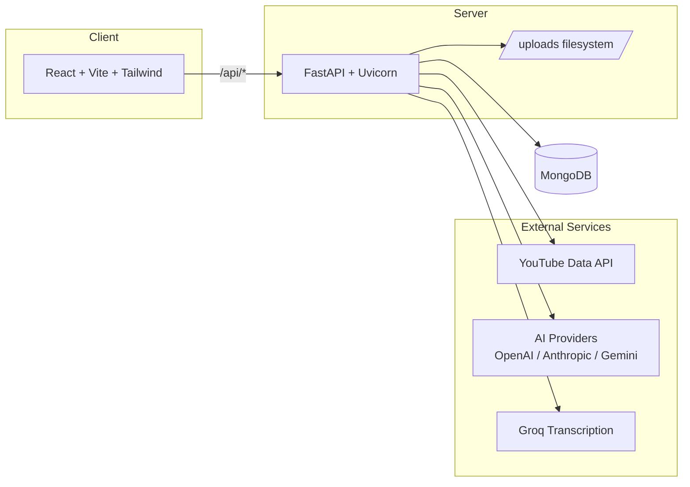
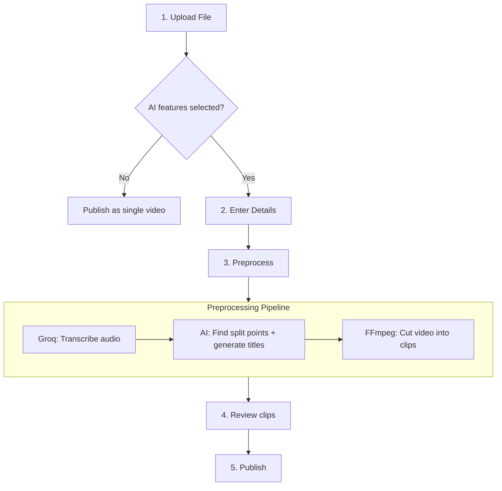
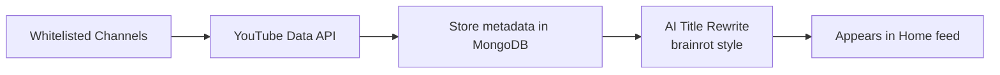

# CrackEd

An educational video platform that makes useful content as clickable and engaging as brain-rot content — without turning the actual material into brain rot.

## Architecture



## Quick Start (Docker)

> [!IMPORTANT]
> You need [Docker](https://www.docker.com/) and Docker Compose installed.

```bash
git clone https://github.com/volam1311/CrackEd
cd CrackEd
docker compose up --build
```

| Service | URL | Description |
|---------|-----|-------------|
| Client | http://localhost:3000 | React app (nginx) |
| Server | http://localhost:8000 | FastAPI |
| MongoDB | localhost:27017 | Database |
| API Docs | http://localhost:8000/docs | Interactive Swagger UI |

To stop:

```bash
docker compose down
```

> [!WARNING]
> Running `docker compose down -v` will **delete all data** including the MongoDB volume and uploaded videos. Only use this if you want a clean slate.

## Quick Start (Local Dev)

### Server

```bash
cd server
python3 -m venv .venv
source .venv/bin/activate
pip install -r requirements.txt
uvicorn app.main:app --reload --port 8000
```

### Client

```bash
cd client
npm install
npm run dev
```

The Vite dev server proxies `/api/*` to `localhost:8000` automatically.

> [!TIP]
> For local dev without Docker, you still need MongoDB running on `localhost:27017`. You can start one with:
> ```bash
> docker run -d -p 27017:27017 mongo:7
> ```

## Configuration (API Keys)

CrackEd uses a **Bring Your Own Key (BYOK)** approach. API keys are stored in your browser's localStorage and sent directly to providers per-request.

> [!IMPORTANT]
> API keys are **never** stored on the server. They exist only in your browser and are sent directly to the provider APIs.

Navigate to **Settings** in the sidebar to configure:

| Key | Purpose |
|-----|---------|
| YouTube Data API Key | Fetching video metadata from whitelisted channels |
| AI Provider + API Key | Title rewriting (brainrot style) and video segmentation |
| Groq API Key | Audio transcription for uploaded video preprocessing |

> [!TIP]
> To find a YouTube channel ID, go to the channel page on YouTube, click "About", then "Share channel" — the ID is the string starting with `UC...`. You can also use https://commentpicker.com/youtube-channel-id.php.

## Seed Data

To populate initial whitelisted channels (3Blue1Brown, StatQuest):

```bash
docker compose exec server python scripts/seed_channels.py
```

## Project Structure

```
CrackEd/
├── client/                  # React + Vite + TypeScript
│   ├── src/
│   │   ├── components/      # Shared UI components
│   │   ├── features/        # Feature-specific components (upload wizard)
│   │   ├── lib/             # Hooks and utilities (apiKeys, format, etc.)
│   │   ├── pages/           # Route pages (Home, Fetch, Upload, Settings)
│   │   └── mocks/           # Mock data for development
│   ├── Dockerfile
│   └── nginx.conf
├── server/                  # FastAPI + Python
│   ├── app/
│   │   ├── routers/         # API endpoints (channels, videos, fetch, upload, title, preprocess)
│   │   ├── models/          # Pydantic models (Channel, Video)
│   │   ├── services/        # Business logic (title_rewrite, segmentation, transcript, video_cutter)
│   │   ├── db.py            # MongoDB connection
│   │   └── main.py          # App entrypoint
│   ├── scripts/             # Seed and verification scripts
│   ├── Dockerfile
│   └── requirements.txt
├── .github/workflows/       # CI/CD (server + client)
├── docker-compose.yml
└── README.md
```

## Upload Pipeline



> [!TIP]
> If no AI features are selected during upload (checkboxes unchecked), the video is published immediately as a single file — no API keys required.

## YouTube Fetch Pipeline



## CI/CD

Two GitHub Actions workflows run on push/PR to `main`:

- **`.github/workflows/cicd-server.yml`** — Lint (ruff) + test (pytest) + Docker build/push to GHCR
- **`.github/workflows/cicd-client.yml`** — Lint (oxlint) + build (vite) + Docker build/push to GHCR

Images are pushed to `ghcr.io/<repo>/server` and `ghcr.io/<repo>/client` tagged with the commit SHA and `latest`.

## Environment Variables

| Variable | Default | Description |
|----------|---------|-------------|
| `MONGO_URL` | `mongodb://mongo:27017` | MongoDB connection string |
| `MONGO_DB` | `cracked` | Database name |

These are set in `docker-compose.yml` for the server container. No other environment variables are required — all API keys are provided via the browser UI.
